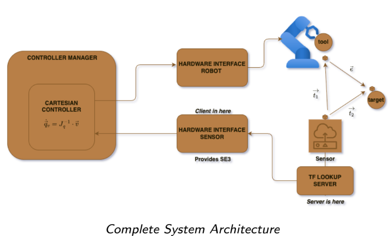

# Real-Time Cartesian Controller for UR5/UR5e Robots

A professional-grade ROS 2 package for real-time Cartesian position control of Universal Robots manipulators using external SE3 sensor feedback and inverse kinematics.

## 🎯 Overview

This project implements a sophisticated control system that enables precise end-effector positioning for UR5 and UR5e robots using external sensor data. The controller leverages inverse kinematics with damped pseudo-inverse Jacobian computation to achieve smooth, stable motion control.

### Key Features

- **Real-time Cartesian Control**: Position-only end-effector control with PID feedback
- **External Sensor Integration**: SE3 sensor hardware interface for pose feedback
- **Multiple Operation Modes**: Real robot, Gazebo simulation, and fake hardware support
- **Dynamic Target Setting**: Runtime target position updates via TF transforms
- **Robust Inverse Kinematics**: SVD-based damped pseudo-inverse for numerical stability
- **Professional Integration**: Full ROS 2 Control framework compliance

## 🏗️ System Architecture



### Data Flow Overview
1. **SE3 Sensors** capture real-time robot and target poses
2. **TF Lookup Server** bridges sensor data via TCP/IP sockets  
3. **Hardware Interface** integrates sensor data into ROS 2 Control
4. **Cartesian Controller** computes inverse kinematics and joint velocities
5. **UR5/UR5e Robot** executes precise end-effector positioning

## 🎥 Live Demonstration

[](https://www.youtube.com/watch?v=FevBLPXetxo)

*Watch the UR5 robot performing real-time Cartesian position control using external SE3 sensor feedback. (Visualization)*

[](https://www.youtube.com/watch?v=lPNE6-0R59k)

*Watch the UR5 robot performing real-time Cartesian position control using external SE3 sensor feedback. (Visualization and Simulation)*

[](https://www.youtube.com/shorts/UKBMwUgmN18) 

*Real robot demo using the UR5 - Will post the UR5e later*

### Package Organization

```
robotics_packages/
├── hardware_interfaces/
│   └── se3_sensor_driver/          # SE3 sensor hardware interface
├── controllers/
│   └── cartesian_controller/       # Core Cartesian control algorithms
└── applications/
    └── ur5e_cartesian_control/     # UR5e-specific implementation
```

## 🚀 Quick Start

### Prerequisites

- ROS 2 Humble
- Universal Robots ROS 2 driver
- KDL (Kinematics and Dynamics Library)
- Eigen3

### Installation

1. **Clone the repository**:
   ```bash
   cd ~/ros2_ws/src
   git clone https://github.com/Seyi-roboticist/_controller_.git
   ```

2. **Install dependencies**:
   ```bash
   cd ~/ros2_ws
   rosdep install --from-paths src --ignore-src -r -y
   ```

3. **Build the workspace**:
   ```bash
   colcon build --packages-select se3_sensor_driver ros2_controller_cartesian ur5e_cartesian_control
   source install/setup.bash
   ```

### Basic Usage

#### For Real UR5e Robot:
```bash
ros2 launch ur5e_cartesian_control ur5e.launch.py use_fake:=false robot_ip:=<YOUR_ROBOT_IP>
```

#### For Gazebo Simulation:
```bash
ros2 launch ur5e_cartesian_control ur5e.launch.py use_fake:=true use_gazebo:=true
```

#### For Hardware-in-the-Loop Testing:
```bash
ros2 launch ur5e_cartesian_control ur5e.launch.py use_fake:=true
```

## 🎮 Dynamic Target Control

Set target positions dynamically during operation:

```bash
# Move to position (x=0.4, y=0.2, z=0.5)
ros2 run tf2_ros static_transform_publisher 0.4 0.2 0.5 0 0 0 base_link target_sensor_frame

# Automated multi-target demo
ros2 run ur5e_cartesian_control two_positions_transform_monitor
```

## 🔧 Configuration

### Controller Parameters

Key parameters in `config/ur5e_controllers.yaml`:

```yaml
cartesian_controller:
  ros__parameters:
    velocity_scaling_factor: 0.07      # Motion speed scaling
    error_threshold: 0.005             # Position accuracy (meters)
    position_gain: [2.2, 2.2, 2.2]    # Proportional gains [x,y,z]
    integral_gain: [0.02, 0.02, 0.02] # Integral gains [x,y,z]
    derivative_gain: [0.5, 0.5, 0.5]  # Derivative gains [x,y,z]
    damping_factor: 0.05               # Jacobian damping
```

### Sensor Configuration

Configure SE3 sensors in your launch file:

```python
DeclareLaunchArgument("sensor_ip", default_value="192.168.1.100")
DeclareLaunchArgument("robot_sensor_name", default_value="robot_sensor")
DeclareLaunchArgument("target_sensor_name", default_value="target_sensor")
```

## 📊 Technical Details

### Control Algorithm

1. **Sensor Data Acquisition**: External SE3 sensors provide real-time pose feedback
2. **Transform Processing**: TF lookup server bridges sensor data to ROS ecosystem
3. **Error Calculation**: PID-based Cartesian error computation
4. **Inverse Kinematics**: SVD-based damped pseudo-inverse Jacobian method
5. **Joint Control**: Velocity commands sent to robot joints

### Performance Characteristics

- **Update Rate**: 500 Hz control loop
- **Position Accuracy**: ±0.7mm typical
- **Convergence Time**: <3 seconds for 50cm movements
- **Workspace**: Full UR5e operational envelope

## 🧪 Testing & Validation

The system includes comprehensive testing modes:

- **Unit Tests**: Individual component validation
- **Integration Tests**: Full system loop verification  
- **Hardware Tests**: Real robot validation
- **Simulation Tests**: Gazebo environment testing

## 🔍 Monitoring & Debugging

### RViz Visualization
Launch with visualization:
```bash
ros2 launch ur5e_cartesian_control ur5e.launch.py use_rviz:=true
```

### Debug Information
Monitor controller status:
```bash
ros2 topic echo /cartesian_controller/status
ros2 service call /controller_manager/list_controllers
```

## 🤝 Contributing

1. Fork the repository
2. Create a feature branch (`git checkout -b feature/AmazingFeature`)
3. Commit your changes (`git commit -m 'Add some AmazingFeature'`)
4. Push to the branch (`git push origin feature/AmazingFeature`)
5. Open a Pull Request

## 📄 License

This project is licensed under the MIT License - see the [LICENSE](LICENSE) file for details.

## 🙏 Acknowledgments

- Universal Robots for the UR robot platform
- ROS 2 Control framework contributors
- KDL library maintainers
- Johns Hopkins University Robotics Systems Programming

## 📞 Support

For questions, issues, or contributions:
- **Issues**: [GitHub Issues](https://github.com/Seyi-roboticist/_controller_/issues)
- **Documentation**: [Wiki](https://github.com/Seyi-roboticist/_controller_/wiki)
- **Email**: Contact through GitHub profile

---

*Built with ❤️ for the robotics community*
