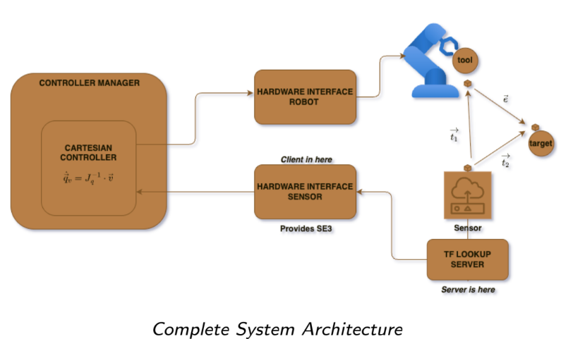
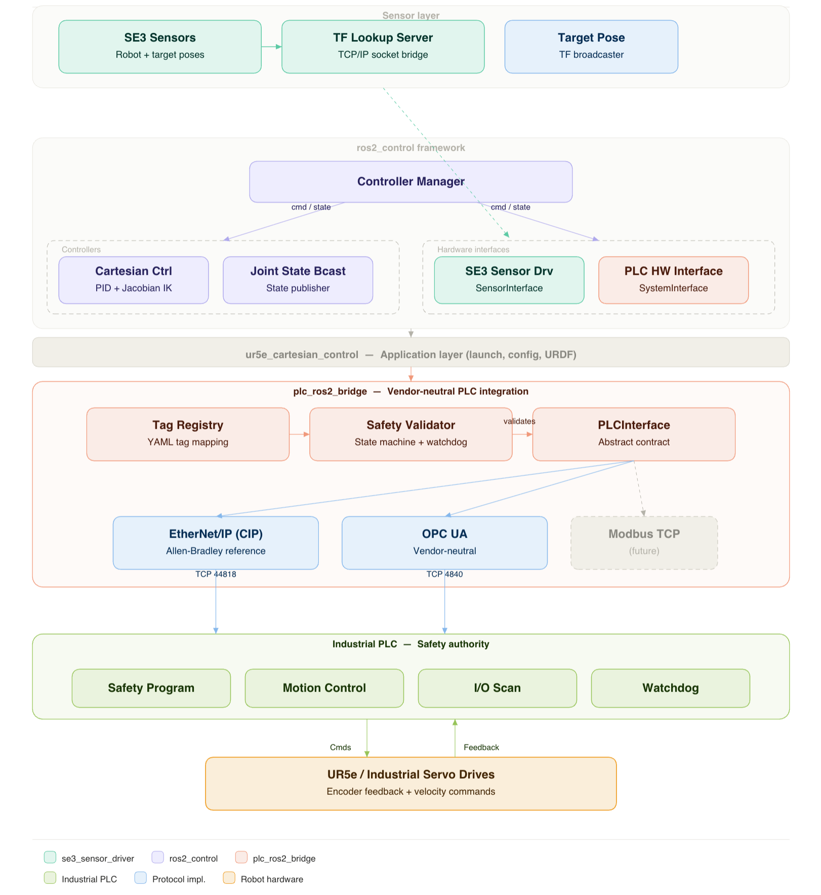

# Real-Time Cartesian Controller & Vendor-Neutral PLC Integration Bridge for UR5/UR5e Robots

Real-time Cartesian controller and vendor-neutral PLC integration bridge for ROS 2 industrial robots, validated on UR5/UR5e manipulators. Features inverse kinematics with SE3 sensor feedback, and a configurable hardware interface supporting EtherNet/IP and OPC UA protocols for PLC-governed manufacturing cells.

## 🎯 Overview

This project implements a sophisticated control system that enables precise end-effector positioning for UR5 and UR5e robots using external sensor data. The controller leverages inverse kinematics with damped pseudo-inverse Jacobian computation to achieve smooth, stable motion control.

In addition, the project includes a **vendor-neutral PLC integration bridge** (`plc_ros2_bridge`) that enables the same ROS 2 control architecture to deploy across heterogeneous industrial PLC environments — Allen-Bradley via EtherNet/IP, Siemens/Beckhoff via OPC UA — without code changes. This package is **under active development**.

### Key Features

- **Real-time Cartesian Control**: Position-only end-effector control with PID feedback
- **External Sensor Integration**: SE3 sensor hardware interface for pose feedback
- **Multiple Operation Modes**: Real robot, Gazebo simulation, and fake hardware support
- **Dynamic Target Setting**: Runtime target position updates via TF transforms
- **Robust Inverse Kinematics**: SVD-based damped pseudo-inverse for numerical stability
- **Professional Integration**: Full ROS 2 Control framework compliance
- **Vendor-Neutral PLC Bridge** *(under development)*: Configurable `ros2_control` hardware interface supporting EtherNet/IP (Allen-Bradley) and OPC UA protocols
- **Safety Validation Layer** *(under development)*: State machine, watchdog, and joint limit enforcement for safe ROS 2 ↔ PLC handoff
- **YAML-Driven Tag Mapping** *(under development)*: Adapt to any PLC program without recompiling — change a config file, not code

## 🏗️ System Architecture

### Architecture 1 — Real-Time Cartesian Control



End-to-end Cartesian position control using external SE3 sensor feedback and inverse kinematics:

1. **SE3 Sensors** capture real-time robot and target poses
2. **TF Lookup Server** bridges sensor data via TCP/IP sockets  
3. **Hardware Interface** integrates sensor data into ROS 2 Control
4. **Cartesian Controller** computes inverse kinematics and joint velocities
5. **UR5/UR5e Robot** executes precise end-effector positioning

### Architecture 2 — Full System with Vendor-Neutral PLC Integration *(Under Development)*



Extends Architecture 1 with a PLC integration bridge, enabling the same Cartesian controller to deploy in PLC-governed manufacturing cells:

1. **SE3 Sensors** capture real-time robot and target poses
2. **TF Lookup Server** bridges sensor data via TCP/IP sockets
3. **Hardware Interface** integrates sensor data into ROS 2 Control
4. **Cartesian Controller** computes inverse kinematics and joint velocities
5. **PLC Bridge** *(under development)* translates joint commands to PLC tags via EtherNet/IP or OPC UA
6. **Safety Validator** *(under development)* enforces joint limits, watchdog, and E-stop monitoring
7. **Industrial PLC** retains ultimate safety authority over robot drives
8. **UR5/UR5e Robot** executes precise end-effector positioning

> **Note:** The Cartesian controller code is identical in both architectures. Only the hardware interface plugin changes — from direct robot communication to PLC-mediated control. This is the vendor-neutral, reusable pattern at the core of this project.

## 🎥 Live Demonstration

[](https://www.youtube.com/watch?v=FevBLPXetxo)

*Watch the UR5 robot performing real-time Cartesian position control using external SE3 sensor feedback. (Visualization)*

[](https://www.youtube.com/watch?v=lPNE6-0R59k)

*Watch the UR5 robot performing real-time Cartesian position control using external SE3 sensor feedback. (Visualization and Simulation)*

[](https://www.youtube.com/shorts/UKBMwUgmN18) 

*Real robot demo using the UR5 - Will post the UR5e later*

### Package Organization

```
robotics_packages/
├── hardware_interfaces/
│   ├── se3_sensor_driver/          # SE3 sensor hardware interface
│   └── plc_ros2_bridge/            # Vendor-neutral PLC integration (under development)
│       ├── include/
│       │   └── plc_ros2_bridge/
│       │       ├── plc_interface.hpp           # Abstract vendor-neutral PLC interface
│       │       ├── ethernet_ip_interface.hpp    # EtherNet/IP (Allen-Bradley) implementation
│       │       ├── opcua_interface.hpp          # OPC UA (vendor-neutral) implementation
│       │       ├── safety_validator.hpp         # Safety validation state machine
│       │       ├── tag_registry.hpp             # ROS 2 ↔ PLC tag mapping
│       │       └── plc_hardware_interface.hpp   # ros2_control SystemInterface
│       ├── src/
│       ├── config/
│       ├── urdf/
│       └── doc/
├── controllers/
│   └── cartesian_controller/       # Core Cartesian control algorithms
└── applications/
    └── ur5e_cartesian_control/     # UR5e-specific implementation
```

## 🚀 Quick Start

### Prerequisites

- ROS 2 Humble
- Universal Robots ROS 2 driver
- KDL (Kinematics and Dynamics Library)
- Eigen3

### Installation

1. **Clone the repository**:
   ```bash
   cd ~/ros2_ws/src
   git clone https://github.com/Seyi-roboticist/_controller_.git
   ```

2. **Install dependencies**:
   ```bash
   cd ~/ros2_ws
   rosdep install --from-paths src --ignore-src -r -y
   ```

3. **Build the workspace**:
   ```bash
   colcon build --packages-select se3_sensor_driver ros2_controller_cartesian ur5e_cartesian_control
   source install/setup.bash
   ```

   To also build the PLC bridge *(under development)*:
   ```bash
   colcon build --packages-select plc_ros2_bridge
   ```

### Basic Usage

#### For Real UR5e Robot:
```bash
ros2 launch ur5e_cartesian_control ur5e.launch.py use_fake:=false robot_ip:=<YOUR_ROBOT_IP>
```

#### For Gazebo Simulation:
```bash
ros2 launch ur5e_cartesian_control ur5e.launch.py use_fake:=true use_gazebo:=true
```

#### For Hardware-in-the-Loop Testing:
```bash
ros2 launch ur5e_cartesian_control ur5e.launch.py use_fake:=true
```

## 🎮 Dynamic Target Control

Set target positions dynamically during operation:

```bash
# Move to position (x=0.4, y=0.2, z=0.5)
ros2 run tf2_ros static_transform_publisher 0.4 0.2 0.5 0 0 0 base_link target_sensor_frame

# Automated multi-target demo
ros2 run ur5e_cartesian_control two_positions_transform_monitor
```

## 🔧 Configuration

### Controller Parameters

Key parameters in `config/ur5e_controllers.yaml`:

```yaml
cartesian_controller:
  ros__parameters:
    velocity_scaling_factor: 0.07      # Motion speed scaling
    error_threshold: 0.005             # Position accuracy (meters)
    position_gain: [2.2, 2.2, 2.2]    # Proportional gains [x,y,z]
    integral_gain: [0.02, 0.02, 0.02] # Integral gains [x,y,z]
    derivative_gain: [0.5, 0.5, 0.5]  # Derivative gains [x,y,z]
    damping_factor: 0.05               # Jacobian damping
```

### Sensor Configuration

Configure SE3 sensors in your launch file:

```python
DeclareLaunchArgument("sensor_ip", default_value="192.168.1.100")
DeclareLaunchArgument("robot_sensor_name", default_value="robot_sensor")
DeclareLaunchArgument("target_sensor_name", default_value="target_sensor")
```

## 🔌 PLC Integration Bridge *(Under Active Development)*

The `plc_ros2_bridge` package provides a vendor-neutral `ros2_control` hardware interface that enables ROS 2 controllers to send commands to and receive feedback from industrial PLCs.

### Architecture

```
ROS 2 Controller → PLCHardwareInterface → SafetyValidator → PLCInterface → PLC → Robot
                   (ros2_control)          (defense-in-depth)  (EtherNet/IP    (safety
                                                                or OPC UA)     authority)
```

The Cartesian controller code is **unchanged** regardless of whether commands go directly to the robot or through a PLC — only the hardware interface plugin swaps. This is the reusable, vendor-neutral pattern that enables deployment across heterogeneous factory floors.

### Supported Protocols

| Protocol | Target PLCs | Status |
|----------|------------|--------|
| **EtherNet/IP (CIP)** | Allen-Bradley ControlLogix, CompactLogix | Reference implementation |
| **OPC UA** | Siemens S7-1500, Beckhoff TwinCAT 3, B&R, Omron | Structural implementation |
| **Modbus TCP** | Legacy systems | Planned |

### Key Components

- **`PLCInterface`** — Abstract vendor-neutral interface defining the read/write/connect contract for PLC communication
- **`EtherNetIPInterface`** — Reference implementation for Allen-Bradley controllers using CIP over TCP/IP
- **`OPCUAInterface`** — Vendor-neutral implementation for OPC UA-enabled controllers
- **`SafetyValidator`** — State machine (IDLE → OPERATIONAL → ESTOP → FAULT) with watchdog timer and joint limit enforcement
- **`TagRegistry`** — Bidirectional ROS 2 ↔ PLC tag mapping loaded from YAML configuration
- **`PLCHardwareInterface`** — The `ros2_control::SystemInterface` that ties everything together

### PLC Bridge Configuration *(Under Development)*

Tag mappings are defined in YAML, enabling deployment to different PLC programs without code changes:

```yaml
tag_mappings:
  - ros2_interface: "shoulder_pan_joint/velocity"
    plc_tag: "Program:MainProgram.ROS_JointVelCmd[0]"
    direction: "to_plc"
    safety_class: "command"

  - ros2_interface: "shoulder_pan_joint/position"
    plc_tag: "Program:MainProgram.ROS_JointPosFb[0]"
    direction: "from_plc"
    safety_class: "status"

watchdog:
  heartbeat_tag: "Program:MainProgram.ROS_Heartbeat"
  timeout_ms: 500
```

### Safety Methodology

The PLC retains ultimate safety authority at all times. The `SafetyValidator` provides defense-in-depth from the ROS 2 side — it validates commands before they reach the PLC but does not replace PLC-based safety functions running on SIL-rated hardware.

For the complete safety methodology, see [`doc/SAFETY_METHODOLOGY.md`](robotics_packages/hardware_interfaces/plc_ros2_bridge/doc/SAFETY_METHODOLOGY.md).

### Development Roadmap

- [x] Abstract `PLCInterface` with vendor-neutral contract
- [x] EtherNet/IP (CIP) reference implementation
- [x] OPC UA structural implementation
- [x] Safety validation interface and state machine design
- [x] YAML-driven tag registry
- [x] `ros2_control` SystemInterface integration
- [ ] Integration testing with Allen-Bradley CompactLogix hardware
- [ ] OPC UA integration with open62541 stack
- [ ] Modbus TCP implementation
- [ ] End-to-end validation with UR5e through PLC

## 📊 Technical Details

### Control Algorithm

1. **Sensor Data Acquisition**: External SE3 sensors provide real-time pose feedback
2. **Transform Processing**: TF lookup server bridges sensor data to ROS ecosystem
3. **Error Calculation**: PID-based Cartesian error computation
4. **Inverse Kinematics**: SVD-based damped pseudo-inverse Jacobian method
5. **Joint Control**: Velocity commands sent to robot joints

### Performance Characteristics

- **Update Rate**: 500 Hz control loop
- **Position Accuracy**: ±0.7mm typical
- **Convergence Time**: <3 seconds for 50cm movements
- **Workspace**: Full UR5e operational envelope

## 🧪 Testing & Validation

The system includes comprehensive testing modes:

- **Unit Tests**: Individual component validation
- **Integration Tests**: Full system loop verification  
- **Hardware Tests**: Real robot validation
- **Simulation Tests**: Gazebo environment testing

## 🔍 Monitoring & Debugging

### RViz Visualization
Launch with visualization:
```bash
ros2 launch ur5e_cartesian_control ur5e.launch.py use_rviz:=true
```

### Debug Information
Monitor controller status:
```bash
ros2 topic echo /cartesian_controller/status
ros2 service call /controller_manager/list_controllers
```

## 🤝 Contributing

1. Fork the repository
2. Create a feature branch (`git checkout -b feature/AmazingFeature`)
3. Commit your changes (`git commit -m 'Add some AmazingFeature'`)
4. Push to the branch (`git push origin feature/AmazingFeature`)
5. Open a Pull Request

## 📄 License

This project is licensed under the MIT License - see the [LICENSE](LICENSE) file for details.

## 🙏 Acknowledgments

- Universal Robots for the UR robot platform
- ROS 2 Control framework contributors
- KDL library maintainers
- Johns Hopkins University Robotics Systems Programming

## 📞 Support

For questions, issues, or contributions:
- **Issues**: [GitHub Issues](https://github.com/Seyi-roboticist/_controller_/issues)
- **Documentation**: [Wiki](https://github.com/Seyi-roboticist/_controller_/wiki)
- **Email**: Contact through GitHub profile

---

*Built with ❤️ for the robotics community*
